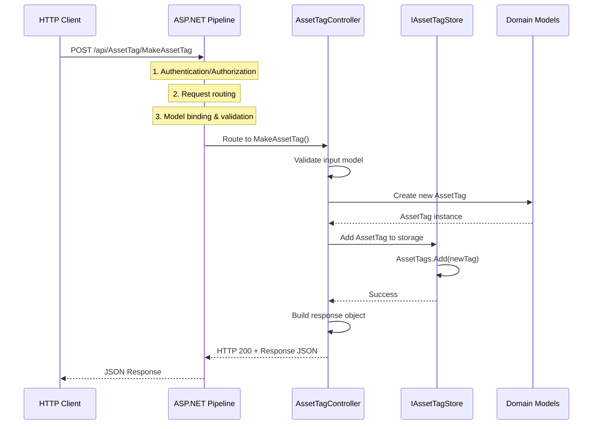
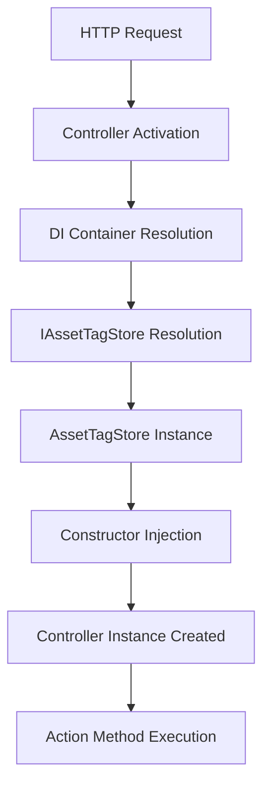

# Architecture Documentation

This document provides a comprehensive overview of the ForAdventure AssetTag API architecture, including system design, request flow, dependency injection patterns, and component interactions.

## System Architecture Overview

The ForAdventure AssetTag API follows a layered architecture pattern built on .NET 8, emphasizing separation of concerns and maintainability.

### High-Level Architecture Diagram

```
┌─────────────────────────────────────────────────────────────────┐
│                        Client Layer                             │
│  ┌─────────────┐  ┌─────────────┐  ┌─────────────────────────┐  │
│  │ Web Browser │  │ Mobile App  │  │  Third-party Systems    │  │
│  │   (Swagger) │  │             │  │   (QR Code Scanners)    │  │
│  └─────────────┘  └─────────────┘  └─────────────────────────┘  │
└─────────────────────────────────────────────────────────────────┘
                                │
                            HTTPS/HTTP
                                │
┌─────────────────────────────────────────────────────────────────┐
│                   Presentation Layer                            │
│  ┌─────────────────────────────────────────────────────────────┐│
│  │               ASP.NET Core Pipeline                         ││
│  │  ┌─────────────┐ ┌──────────────┐ ┌──────────────────────┐ ││
│  │  │ Middleware  │ │ Routing      │ │  Model Binding       │ ││
│  │  │ Pipeline    │ │ Filters      │ │  Validation          │ ││
│  │  └─────────────┘ └──────────────┘ └──────────────────────┘ ││
│  └─────────────────────────────────────────────────────────────┘│
│                                │                                │
│  ┌─────────────────────────────────────────────────────────────┐│
│  │                   Controllers                               ││
│  │  ┌─────────────────────────────────────────────────────────┐││
│  │  │           AssetTagController                            │││
│  │  │  • MakeAssetTag() - POST /api/AssetTag/MakeAssetTag    │││
│  │  │  • Handles HTTP requests and responses                 │││
│  │  │  • Input validation and error handling                 │││
│  │  └─────────────────────────────────────────────────────────┘││
│  └─────────────────────────────────────────────────────────────┘│
│                                │                                │
│  ┌─────────────────────────────────────────────────────────────┐│
│  │               Minimal API Endpoints                         ││
│  │  ┌─────────────────────────────────────────────────────────┐││
│  │  │ TripPlanEndpoints       │ AssetTagEndpoints             │││
│  │  │ • GET /api/TripPlan     │ • GET /api/AssetTag          │││
│  │  │ • POST /api/TripPlan    │ • POST /api/AssetTag         │││
│  │  │ • PUT /api/TripPlan/{id}│ • PUT /api/AssetTag/{id}     │││
│  │  │ • DELETE /api/TripPlan  │ • DELETE /api/AssetTag       │││
│  │  └─────────────────────────────────────────────────────────┘││
│  └─────────────────────────────────────────────────────────────┘│
└─────────────────────────────────────────────────────────────────┘
                                │
┌─────────────────────────────────────────────────────────────────┐
│                    Business Logic Layer                         │
│  ┌─────────────────────────────────────────────────────────────┐│
│  │                    Services                                 ││
│  │  ┌───────────────────────┐  ┌───────────────────────────────┐││
│  │  │  AdventureAPIService  │  │    ForAdventureLogic          │││  
│  │  │  • External API calls│  │    • Business rules           │││
│  │  │  • HTTP client mgmt  │  │    • Trip plan narratives     │││
│  │  │  • JSON serialization│  │    • Data transformations     │││
│  │  └───────────────────────┘  └───────────────────────────────┘││
│  └─────────────────────────────────────────────────────────────┘│
└─────────────────────────────────────────────────────────────────┘
                                │
┌─────────────────────────────────────────────────────────────────┐
│                      Data Layer                                 │
│  ┌─────────────────────────────────────────────────────────────┐│
│  │                Data Access Abstraction                     ││
│  │  ┌─────────────────────────────────────────────────────────┐││
│  │  │               IAssetTagStore                            │││
│  │  │  • Interface defining data operations                  │││
│  │  │  • Abstraction over storage mechanisms                 │││
│  │  └─────────────────────────────────────────────────────────┘││
│  └─────────────────────────────────────────────────────────────┘│
│                                │                                │
│  ┌─────────────────────────────────────────────────────────────┐│
│  │              Current Implementation                         ││
│  │  ┌─────────────────────────────────────────────────────────┐││
│  │  │              AssetTagStore                              │││
│  │  │  • In-memory List<AssetTag> storage                    │││
│  │  │  • Singleton lifetime                                   │││
│  │  │  • Fast access for development/testing                 │││
│  │  └─────────────────────────────────────────────────────────┘││
│  └─────────────────────────────────────────────────────────────┘│
└─────────────────────────────────────────────────────────────────┘
```

## Request Lifecycle

### HTTP Request Flow

The following sequence diagram illustrates the complete request lifecycle from HTTP request to response:



### Detailed Request Processing Steps

1. **Request Reception**
   - Kestrel web server receives HTTP request
   - Request enters ASP.NET Core middleware pipeline

2. **Middleware Pipeline Processing**
   ```csharp
   // In Program.cs
   app.UseHttpsRedirection();  // HTTPS redirect
   app.UseAuthorization();     // Authorization middleware
   app.MapControllers();       // Controller routing
   ```

3. **Routing & Model Binding**
   - Route matching: `/api/AssetTag/MakeAssetTag` → `AssetTagController.MakeAssetTag()`
   - JSON request body deserialized to `AssetTag` model
   - Model validation occurs automatically

4. **Controller Action Execution**
   ```csharp
   [HttpPost("MakeAssetTag")]
   public IActionResult MakeAssetTag([FromBody] AssetTag assetTag)
   {
       // Business logic execution
       // Data persistence
       // Response generation
   }
   ```

5. **Response Serialization & Return**
   - Response object serialized to JSON
   - HTTP status code set (200 OK)
   - Response sent back through middleware pipeline

## Dependency Injection Architecture

### Current DI Container Setup

The application uses .NET's built-in dependency injection container configured in `Program.cs`:

```csharp
var builder = WebApplication.CreateBuilder(args);

// Service Registration
builder.Services.AddControllers();           // MVC Controllers
builder.Services.AddEndpointsApiExplorer();  // API Explorer for OpenAPI
builder.Services.AddSwaggerGen();            // Swagger documentation
builder.Services.AddSingleton<IAssetTagStore, AssetTagStore>(); // Data storage

var app = builder.Build();
```

### Service Lifetimes Analysis

| Service | Interface | Implementation | Lifetime | Rationale |
|---------|-----------|----------------|----------|-----------|
| `IAssetTagStore` | `IAssetTagStore` | `AssetTagStore` | **Singleton** | In-memory storage needs to persist across requests |
| `ILogger<T>` | `ILogger<AssetTagController>` | Built-in | **Singleton** | Logging infrastructure |
| Controllers | N/A | `AssetTagController` | **Transient** | New instance per request (default) |

### Dependency Injection Flow



### Constructor Injection Pattern

```csharp
public class AssetTagController : ControllerBase
{
    private readonly IAssetTagStore _store;
    private readonly ILogger<AssetTagController> _logger;

    // Constructor injection - dependencies resolved by DI container
    public AssetTagController(IAssetTagStore store, ILogger<AssetTagController> logger)
    {
        _store = store;      // Injected singleton instance
        _logger = logger;    // Injected logger instance
    }
}
```

## Domain Model Architecture

### Core Domain Models

```mermaid
classDiagram
    class AssetTag {
        +Guid Id
        +string TagCode
        +Guid UserId
        +List~EmergencyContact~ EmergencyContacts
        +List~TripPlan~ TripPlans
    }
    
    class EmergencyContact {
        +Guid Id
        +string Name
        +string Phone
        +string Email
    }
    
    class TripPlan {
        +Guid TripIdentifier
        +string TripRoutePreference
        +string TripRoute
        +DateTime TripStartDate
        +DateTime TripEndDate
        +int TripDurationDays
        +List~LocationCoordinates~ TripLocationStart
        +List~LocationCoordinates~ TripLocationEnd
        +List~LocationCoordinates~ TripFeaturedLocation
    }
    
    class LocationCoordinates {
        +Guid LocationIdentifier
        +string LocationName
        +string LocationGPSformat01
        +string LocationGPSformat02
        +string LocationWhatThreeWords
        +string LocationAppleMap
        +string LocationGoogleMap
        +string LocationAddressCriteria
    }
    
    AssetTag ||--o{ EmergencyContact : contains
    AssetTag ||--o{ TripPlan : contains
    TripPlan ||--o{ LocationCoordinates : contains
```

### Data Storage Interface Design

```csharp
public interface IAssetTagStore
{
    List<AssetTag> AssetTags { get; }
}

public class AssetTagStore : IAssetTagStore
{
    public List<AssetTag> AssetTags { get; } = new List<AssetTag>();
}
```

**Design Benefits:**
- **Abstraction**: Interface hides implementation details
- **Testability**: Easy to mock for unit testing
- **Flexibility**: Can swap implementations (in-memory → database)
- **Dependency Inversion**: High-level modules don't depend on low-level modules

## Service Layer Architecture

### AdventureAPIService

External service integration layer for HTTP communication:

```csharp
public class AdventureAPIService
{
    private readonly HttpClient _client = new HttpClient();
    private const string BaseUrl = "http://localhost:5034/api";
    
    // Async operations for external API calls
    public async Task<AssetTag> CreateAssetTagAsync(Guid userId) { }
    public async Task<TripPlan> AddTripPlanAsync(TripPlan plan) { }
    public async Task<AssetTag> GetAssetTagAsync(string tagCode) { }
    public async Task<string> SendEmergencyAlertAsync(string tagCode) { }
}
```

### ForAdventureLogic

Business logic and domain operations:

```csharp
public static class ForAdventureLogic
{
    public static string generateTripPlanNarrative(TripPlan tripPlan)
    {
        // Business logic for generating human-readable trip descriptions
    }
}
```

## Middleware Pipeline

### Current Pipeline Configuration

```csharp
// Development environment
if (app.Environment.IsDevelopment())
{
    app.UseSwagger();      // Enable Swagger JSON endpoint
    app.UseSwaggerUI();    // Enable Swagger UI
}

app.UseHttpsRedirection(); // Force HTTPS
app.UseAuthorization();    // Authorization middleware
app.MapControllers();      // Map controller routes
app.MapTripPlanEndpoints(); // Map minimal API endpoints
```

### Middleware Execution Order

```
Request → HTTPS Redirect → Authorization → Routing → Controller/Endpoint → Response
```

## Scalability Considerations

### Current Architecture Limitations

1. **In-Memory Storage**: Data lost on application restart
2. **Singleton HttpClient**: Potential socket exhaustion
3. **No Caching**: Every request hits storage directly
4. **No Authentication**: Open API access

### Recommended Improvements

1. **Persistent Storage**
   ```csharp
   // Replace with Entity Framework
   builder.Services.AddDbContext<AssetTagContext>(options =>
       options.UseSqlServer(connectionString));
   builder.Services.AddScoped<IAssetTagStore, DatabaseAssetTagStore>();
   ```

2. **HTTP Client Factory**
   ```csharp
   builder.Services.AddHttpClient<AdventureAPIService>();
   ```

3. **Caching Layer**
   ```csharp
   builder.Services.AddMemoryCache();
   builder.Services.AddDistributedMemoryCache();
   ```

4. **Authentication & Authorization**
   ```csharp
   builder.Services.AddAuthentication(JwtBearerDefaults.AuthenticationScheme)
       .AddJwtBearer(options => { /* JWT config */ });
   ```

## Error Handling Architecture

### Current Error Handling

The application relies on default ASP.NET Core error handling:
- Model validation errors return 400 Bad Request
- Unhandled exceptions return 500 Internal Server Error
- Route mismatches return 404 Not Found

### Recommended Error Handling Improvements

1. **Global Exception Handler**
   ```csharp
   app.UseExceptionHandler("/error");
   app.UseStatusCodePages();
   ```

2. **Custom Exception Middleware**
   ```csharp
   public class GlobalExceptionMiddleware
   {
       // Centralized exception handling and logging
   }
   ```

3. **Structured Error Responses**
   ```csharp
   public class ApiErrorResponse
   {
       public string Message { get; set; }
       public string Details { get; set; }
       public int StatusCode { get; set; }
   }
   ```

## Testing Architecture

### Current Test Structure

```
AssetTag.API.test/
└── AdventureTagTests/
    ├── AssetTagControllerTests.cs
    └── AdventureTagTests.csproj
```

### Test Dependencies

- **xUnit**: Primary testing framework
- **Moq**: Mocking framework for dependencies
- **Microsoft.NET.Test.SDK**: Test discovery and execution

### Recommended Testing Improvements

1. **Integration Tests**
   ```csharp
   public class AssetTagIntegrationTests : IClassFixture<WebApplicationFactory<Program>>
   {
       // End-to-end API testing
   }
   ```

2. **Test Categories**
   - Unit Tests: Individual component testing
   - Integration Tests: API endpoint testing
   - Contract Tests: API contract validation

## Performance Considerations

### Current Performance Characteristics

- **Memory Usage**: O(n) where n = number of stored AssetTags
- **Request Latency**: Low (in-memory operations)
- **Throughput**: Limited by single-threaded in-memory store

### Performance Optimization Strategies

1. **Asynchronous Programming**
   ```csharp
   public async Task<IActionResult> MakeAssetTagAsync([FromBody] AssetTag assetTag)
   {
       await _store.AddAsync(assetTag);
       return Ok(response);
   }
   ```

2. **Response Caching**
   ```csharp
   [ResponseCache(Duration = 300)] // 5-minute cache
   public IActionResult GetAssetTags() { }
   ```

3. **Database Optimization**
   - Entity Framework query optimization
   - Database indexing strategies
   - Connection pooling

## Security Architecture

### Current Security Posture

- **HTTPS Enforcement**: Redirects HTTP to HTTPS
- **Input Validation**: Model binding validation
- **No Authentication**: Open API access

### Security Hardening Recommendations

1. **Authentication & Authorization**
2. **Input Sanitization**
3. **Rate Limiting**
4. **CORS Configuration**
5. **Security Headers**

---

This architecture documentation provides the foundation for understanding the current system design and planning future enhancements. The modular architecture supports incremental improvements while maintaining system stability.